# Demo program screenshots

## [AttrDemo.hs](https://github.com/jtdaugherty/brick/blob/master/programs/AttrDemo.hs)
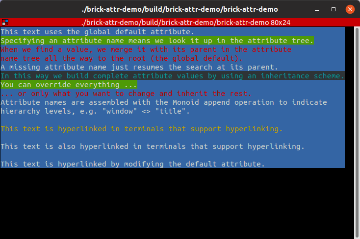

## [BorderDemo.hs](https://github.com/jtdaugherty/brick/blob/master/programs/BorderDemo.hs)
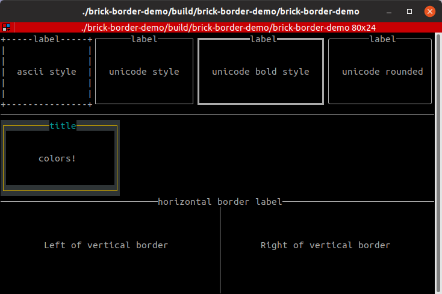

## [CacheDemo.hs](https://github.com/jtdaugherty/brick/blob/master/programs/CacheDemo.hs)
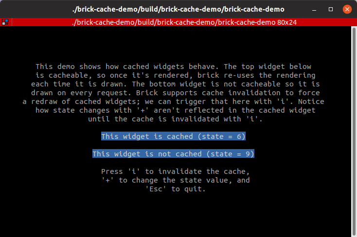

## [CustomEventDemo.hs](https://github.com/jtdaugherty/brick/blob/master/programs/CustomEventDemo.hs)
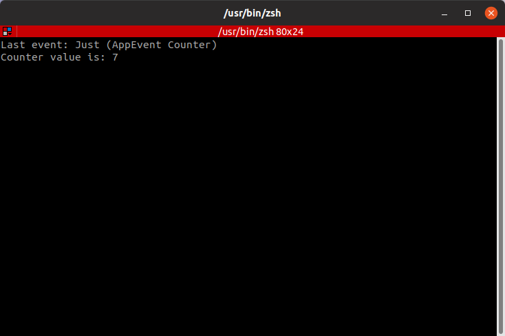

## [DialogDemo.hs](https://github.com/jtdaugherty/brick/blob/master/programs/DialogDemo.hs)
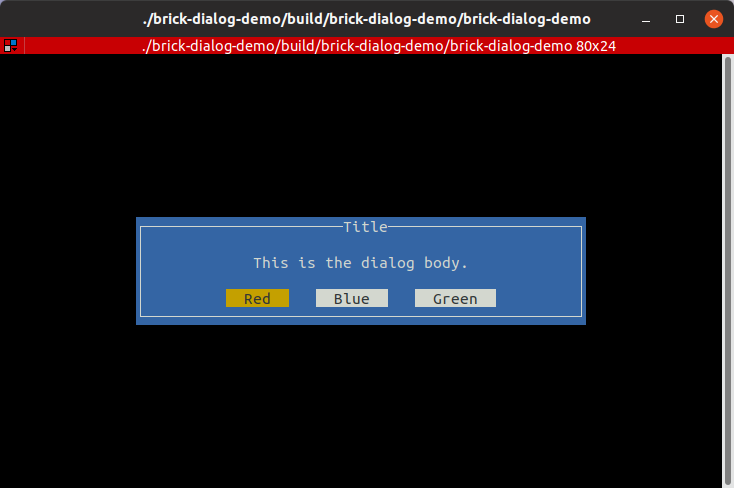

## [DynamicBorderDemo.hs](https://github.com/jtdaugherty/brick/blob/master/programs/DynamicBorderDemo.hs)

## [EditDemo.hs](https://github.com/jtdaugherty/brick/blob/master/programs/EditDemo.hs)
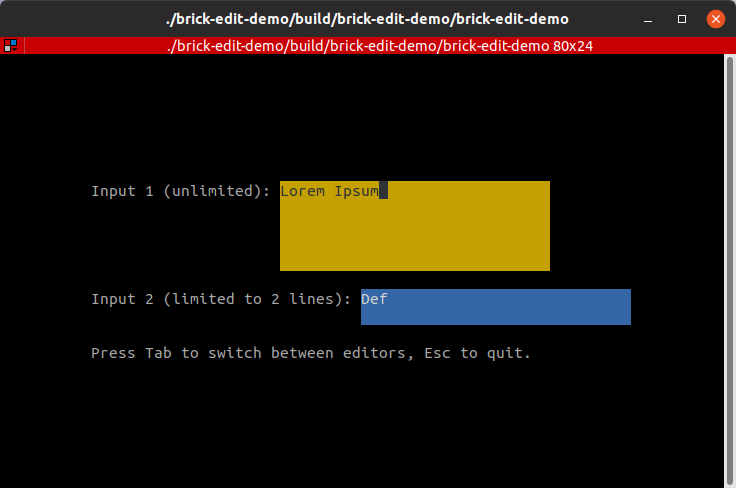

## [FileBrowserDemo.hs](https://github.com/jtdaugherty/brick/blob/master/programs/FileBrowserDemo.hs)
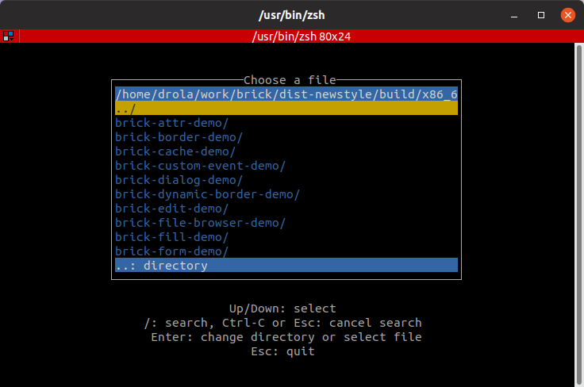

## [FillDemo.hs](https://github.com/jtdaugherty/brick/blob/master/programs/FillDemo.hs)
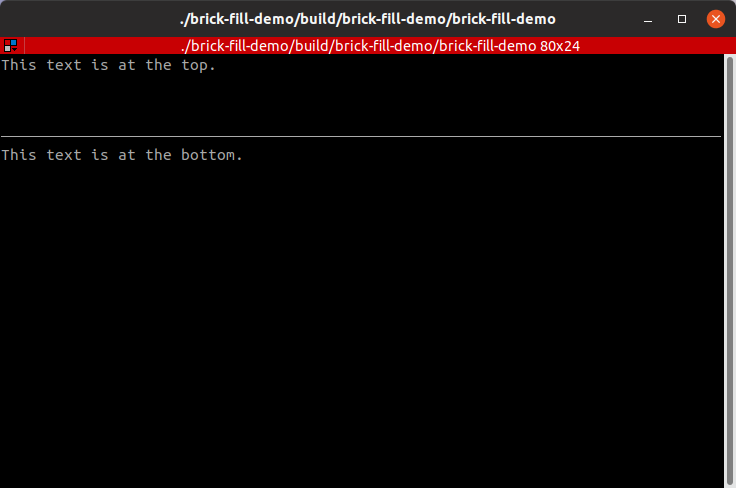

## [FormDemo.hs](https://github.com/jtdaugherty/brick/blob/master/programs/FormDemo.hs)
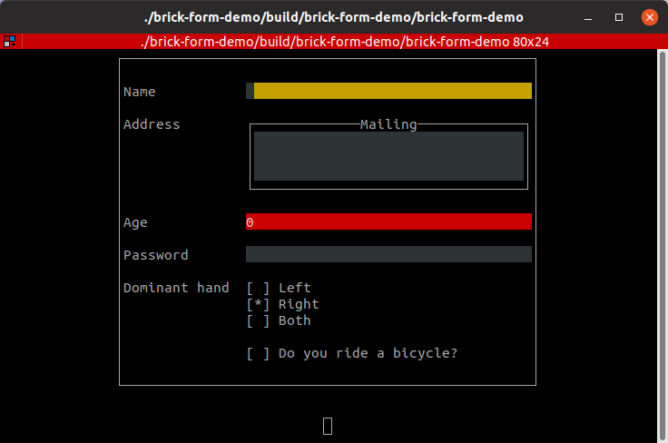

## [HelloWorldDemo.hs](https://github.com/jtdaugherty/brick/blob/master/programs/HelloWorldDemo.hs)
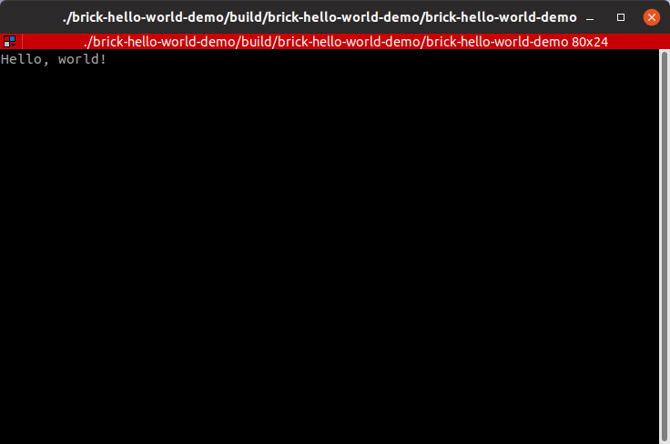

## [LayerDemo.hs](https://github.com/jtdaugherty/brick/blob/master/programs/LayerDemo.hs)
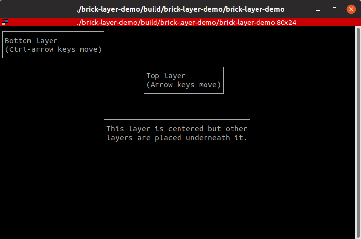

## [ListDemo.hs](https://github.com/jtdaugherty/brick/blob/master/programs/ListDemo.hs)
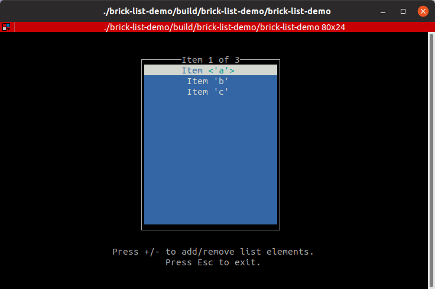

## [ListViDemo.hs](https://github.com/jtdaugherty/brick/blob/master/programs/ListViDemo.hs)
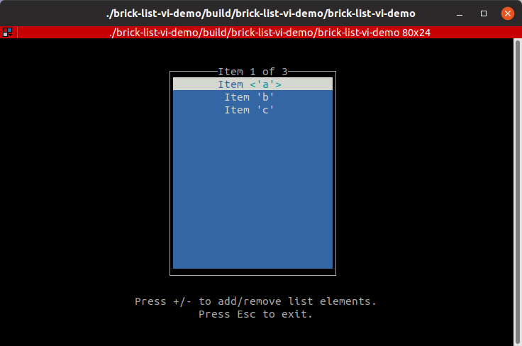

## [MarkupDemo.hs](https://github.com/jtdaugherty/brick/blob/master/programs/MarkupDemo.hs)
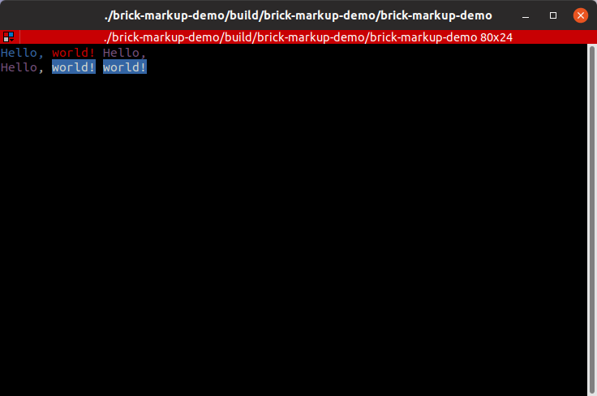

## [MouseDemo.hs](https://github.com/jtdaugherty/brick/blob/master/programs/MouseDemo.hs)
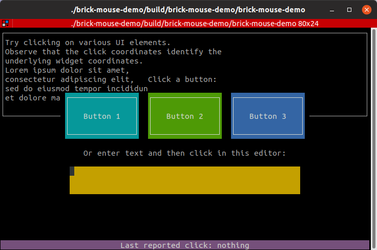

## [PaddingDemo.hs](https://github.com/jtdaugherty/brick/blob/master/programs/PaddingDemo.hs)
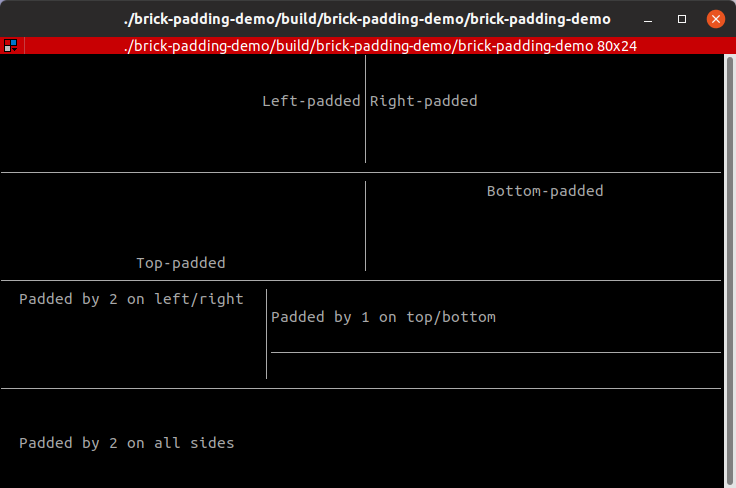

## [ProgressBarDemo.hs](https://github.com/jtdaugherty/brick/blob/master/programs/ProgressBarDemo.hs)
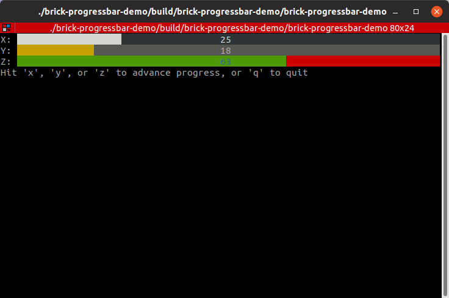

## [ReadmeDemo.hs](https://github.com/jtdaugherty/brick/blob/master/programs/ReadmeDemo.hs)
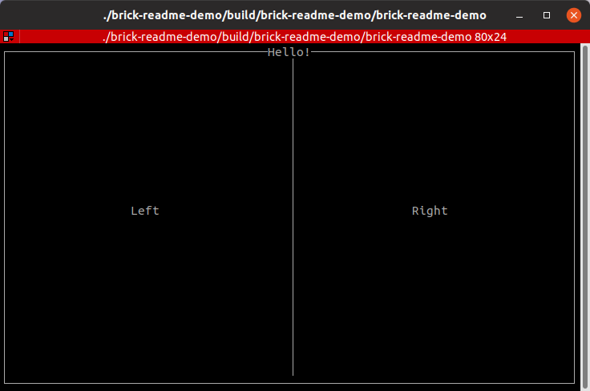

## [SuspendAndResumeDemo.hs](https://github.com/jtdaugherty/brick/blob/master/programs/SuspendAndResumeDemo.hs)
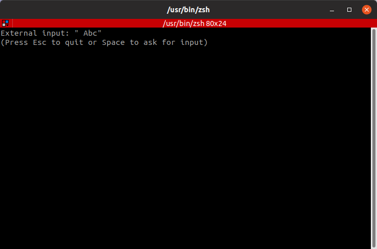

## [TextWrapDemo.hs](https://github.com/jtdaugherty/brick/blob/master/programs/TextWrapDemo.hs)
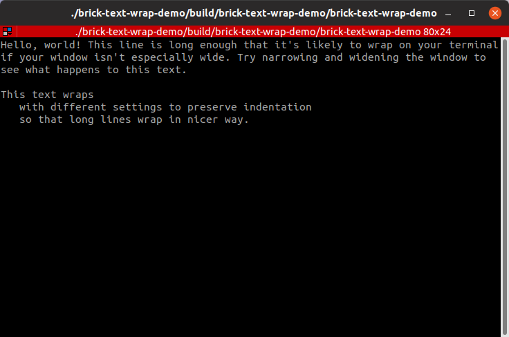

## [ThemeDemo.hs](https://github.com/jtdaugherty/brick/blob/master/programs/ThemeDemo.hs)
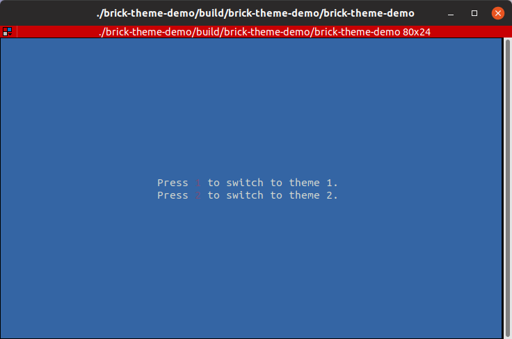

## [ViewportScrollDemo.hs](https://github.com/jtdaugherty/brick/blob/master/programs/ViewportScrollDemo.hs)
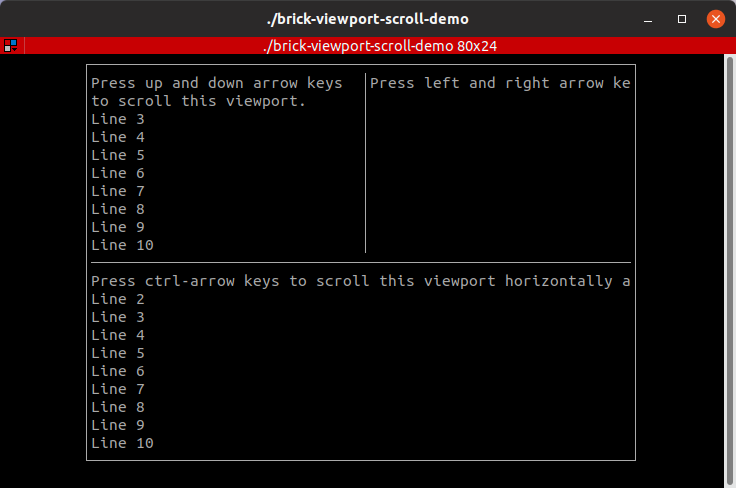

## [VisibilityDemo.hs](https://github.com/jtdaugherty/brick/blob/master/programs/VisibilityDemo.hs)
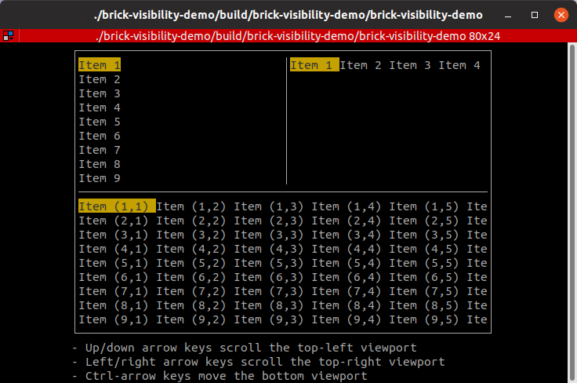
