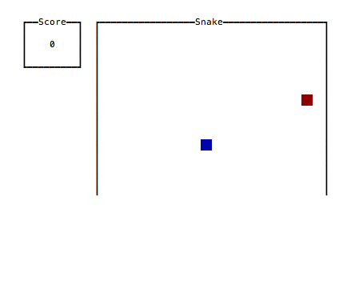

# Brick Tutorial by Samuel Tay

This tutorial was written by Samuel Tay, Copyright 2017
(https://github.com/samtay, https://samtay.github.io/). It is provided
as part of the brick distribution with permission.

## Introduction

I'm going to give a short introduction to
[brick](https://hackage.haskell.org/package/brick), a Haskell library
for building terminal user interfaces. So far I've used `brick` to
implement [Conway's Game of Life](https://github.com/samtay/conway) and
a [Tetris clone](https://github.com/samtay/tetris). I'll explain the
basics, walk through an example [snake](https://github.com/samtay/snake)
application, and then explain some more complicated scenarios.

The first thing I'll say is that this package has some of the most
impressive documentation and resources, which makes it easy to figure
out pretty much anything you need to do. I'll try to make this useful,
but I imagine if you're reading this then it is mostly being used as a
reference in addition to the existing resources:

1. [Demo programs](https://github.com/jtdaugherty/brick/tree/master/programs)
(clone down to explore the code and run them locally)
2. [User guide](https://github.com/jtdaugherty/brick/blob/master/docs/guide.rst)
3. [Haddock docs](https://hackage.haskell.org/package/brick-0.18)
4. [Google group](https://groups.google.com/forum/#!forum/brick-users)

### The basic idea

`brick` is very declarative. Once your base application logic is in
place, the interface is generally built by two functions: drawing and
handling events. The drawing function

```haskell
appDraw :: s -> [Widget n]
```

takes your app state `s` and produces the visuals `[Widget n]`. The
handler

```haskell
appHandleEvent :: s -> BrickEvent n e -> EventM n (Next s)
```

takes your app state, an event (e.g. user presses the `'m'` key), and
produces the resulting app state. *That's pretty much it.*

## `snake`

We're going to build the [classic
snake](https://en.wikipedia.org/wiki/Snake_(video_game)) game that you
might recall from arcades or the first cell phones. The full source code
is [here](https://github.com/samtay/snake). This is the end product:



### Structure of the app

The library makes it easy to separate the concerns of your application
and the interface; I like to have a module with all of the core business
logic that exports the core state of the app and functions for modifying
it, and then have an interface module that just handles the setup,
drawing, and handling events. So let's just use the `simple` stack
template and add two modules

```
├── LICENSE
├── README.md
├── Setup.hs
├── snake.cabal
├── src
│   ├── Main.hs
│   ├── Snake.hs
│   └── UI.hs
└── stack.yaml
```

and our dependencies to `test.cabal`

```yaml
executable snake
  hs-source-dirs:      src
  main-is:             Main.hs
  exposed-modules:     Snake
                     , UI
  default-language:    Haskell2010
  build-depends:       base >= 4.7 && < 5
                     , brick
                     , containers
                     , linear
                     , microlens
                     , microlens-th
                     , random
```

### `Snake`

Since this tutorial is about `brick`, I'll elide most of the
implementation details of the actual game, but here are some of the key
types and scaffolding:

```haskell
{-# LANGUAGE TemplateHaskell, FlexibleContexts #-}
module Snake where

import Control.Applicative ((<|>))
import Control.Monad (guard)
import Data.Maybe (fromMaybe)

import Data.Sequence (Seq, ViewL(..), ViewR(..), (<|))
import qualified Data.Sequence as S
import Lens.Micro.TH (makeLenses)
import Lens.Micro ((&), (.~), (%~), (^.))
import Linear.V2 (V2(..), _x, _y)
import System.Random (Random(..), newStdGen)

-- Types

data Game = Game
  { _snake  :: Snake        -- ^ snake as a sequence of points in R2
  , _dir    :: Direction    -- ^ direction
  , _food   :: Coord        -- ^ location of the food
  , _foods  :: Stream Coord -- ^ infinite list of random food locations
  , _dead   :: Bool         -- ^ game over flag
  , _paused :: Bool         -- ^ paused flag
  , _score  :: Int          -- ^ score
  , _frozen :: Bool         -- ^ freeze to disallow duplicate turns
  } deriving (Show)

type Coord = V2 Int
type Snake = Seq Coord

data Stream a = a :| Stream a
  deriving (Show)

data Direction
  = North
  | South
  | East
  | West
  deriving (Eq, Show)
```

All of this is pretty self-explanatory, with the possible exception
of lenses if you haven't seen them. At first glance they may seem
complicated (and the underlying theory arguably is), but using them as
getters and setters is very straightforward. So, if you are following
along because you are writing a terminal app like this, I'd recommend
using them, but they are not required to use `brick`.

Here are the core functions for playing the game:

```haskell
-- | Step forward in time
step :: Game -> Game
step g = fromMaybe g $ do
  guard (not $ g ^. paused || g ^. dead)
  let g' = g & frozen .~ False
  return . fromMaybe (move g') $ die g' <|> eatFood g'

-- | Possibly die if next head position is disallowed
die :: Game -> Maybe Game

-- | Possibly eat food if next head position is food
eatFood :: Game -> Maybe Game

-- | Move snake along in a marquee fashion
move :: Game -> Game

-- | Turn game direction (only turns orthogonally)
--
-- Implicitly unpauses yet freezes game
turn :: Direction -> Game -> Game

-- | Initialize a paused game with random food location
initGame :: IO Game
```

### `UI`

To start, we need to determine what our `App s e n` type parameters are.
This will completely describe the interface application and be passed
to one of the library's `main` style functions for execution. Note that
`s` is the app state, `e` is an event type, and `n` is a resource name.
The `e` is abstracted so that we can provide custom events. The `n`
is usually a custom sum type called `Name` which allows us to *name*
particular viewports. This is important so that we can keep track of
where the user currently has *focus*, such as typing in one of two
textboxes; however, for this simple snake game we don't need to worry
about that.

In simpler cases, the state `s` can directly coincide with a core
datatype such as our `Snake.Game`. In many cases however, it will be
necessary to wrap the core state within the ui state `s` to keep track
of things that are interface specific (more on this later).

Let's write out our app definition and leave some undefined functions:

```haskell
{-# LANGUAGE OverloadedStrings #-}
module UI where

import Control.Monad (forever, void)
import Control.Monad.IO.Class (liftIO)
import Control.Concurrent (threadDelay, forkIO)
import Data.Maybe (fromMaybe)

import Snake

import Brick
  ( App(..), AttrMap, BrickEvent(..), EventM, Next, Widget
  , customMain, neverShowCursor
  , continue, halt
  , hLimit, vLimit, vBox, hBox
  , padRight, padLeft, padTop, padAll, Padding(..)
  , withBorderStyle
  , str
  , attrMap, withAttr, emptyWidget, AttrName, on, fg
  , (<+>)
  )
import Brick.BChan (newBChan, writeBChan)
import qualified Brick.Widgets.Border as B
import qualified Brick.Widgets.Border.Style as BS
import qualified Brick.Widgets.Center as C
import qualified Graphics.Vty as V
import Data.Sequence (Seq)
import qualified Data.Sequence as S
import Linear.V2 (V2(..))
import Lens.Micro ((^.))

-- Types

-- | Ticks mark passing of time
--
-- This is our custom event that will be constantly fed into the app.
data Tick = Tick

-- | Named resources
--
-- Not currently used, but will be easier to refactor
-- if we call this "Name" now.
type Name = ()

data Cell = Snake | Food | Empty

-- App definition

app :: App Game Tick Name
app = App { appDraw = drawUI
          , appChooseCursor = neverShowCursor
          , appHandleEvent = handleEvent
          , appStartEvent = return
          , appAttrMap = const theMap
          }

main :: IO ()
main = undefined

-- Handling events

handleEvent :: Game -> BrickEvent Name Tick -> EventM Name (Next Game)
handleEvent = undefined

-- Drawing

drawUI :: Game -> [Widget Name]
drawUI = undefined

theMap :: AttrMap
theMap = undefined
```

#### Custom Events

So far I've only used `brick` to make games which need to be redrawn
as time passes, with or without user input. This requires using
`Brick.customMain` with that `Tick` event type, and opening a forked
process to `forever` feed that event type into the channel. Since this
is a common scenario, there is a `Brick.BChan` module that makes this
pretty quick:

```haskell
main :: IO ()
main = do
  chan <- newBChan 10
  forkIO $ forever $ do
    writeBChan chan Tick
    threadDelay 100000 -- decides how fast your game moves
  g <- initGame
  void $ customMain (V.mkVty V.defaultConfig) (Just chan) app g
```

We do need to import `Vty.Graphics` since `customMain` allows us
to specify a custom `IO Vty.Graphics.Vty` handle, but we're only
customizing the existence of the event channel `BChan Tick`. The app
is now bootstrapped, and all we need to do is implement `handleEvent`,
`drawUI`, and `theMap` (handles styling).

#### Handling events

Handling events is largely straightforward, and can be very clean when
your underlying application logic is taken care of in a core module. All
we do is essentially map events to the proper state modifiers.

```haskell
handleEvent :: Game -> BrickEvent Name Tick -> EventM Name (Next Game)
handleEvent g (AppEvent Tick)                       = continue $ step g
handleEvent g (VtyEvent (V.EvKey V.KUp []))         = continue $ turn North g
handleEvent g (VtyEvent (V.EvKey V.KDown []))       = continue $ turn South g
handleEvent g (VtyEvent (V.EvKey V.KRight []))      = continue $ turn East g
handleEvent g (VtyEvent (V.EvKey V.KLeft []))       = continue $ turn West g
handleEvent g (VtyEvent (V.EvKey (V.KChar 'k') [])) = continue $ turn North g
handleEvent g (VtyEvent (V.EvKey (V.KChar 'j') [])) = continue $ turn South g
handleEvent g (VtyEvent (V.EvKey (V.KChar 'l') [])) = continue $ turn East g
handleEvent g (VtyEvent (V.EvKey (V.KChar 'h') [])) = continue $ turn West g
handleEvent g (VtyEvent (V.EvKey (V.KChar 'r') [])) = liftIO (initGame) >>= continue
handleEvent g (VtyEvent (V.EvKey (V.KChar 'q') [])) = halt g
handleEvent g (VtyEvent (V.EvKey V.KEsc []))        = halt g
handleEvent g _                                     = continue g
```

It's probably obvious, but `continue` will continue execution with
the supplied state value, which is then drawn. We can also `halt` to
stop execution, which will essentially finish the evaluation of our
`customMain` and result in `IO Game`, where the resulting game is the
last value that we supplied to `halt`.

#### Drawing

Drawing is fairly simple as well but can require a good amount of code
to position things how you want them. I like to break up the visual
space into regions with drawing functions for each one.

```haskell
drawUI :: Game -> [Widget Name]
drawUI g =
  [ C.center $ padRight (Pad 2) (drawStats g) <+> drawGrid g ]

drawStats :: Game -> Widget Name
drawStats = undefined

drawGrid :: Game -> Widget Name
drawGrid = undefined
```

This will center the overall interface (`C.center`), put the stats and
grid widgets horizontally side by side (`<+>`), and separate them by a
2-character width (`padRight (Pad 2)`).

Let's move forward with the stats column:

```haskell
drawStats :: Game -> Widget Name
drawStats g = hLimit 11
  $ vBox [ drawScore (g ^. score)
         , padTop (Pad 2) $ drawGameOver (g ^. dead)
         ]

drawScore :: Int -> Widget Name
drawScore n = withBorderStyle BS.unicodeBold
  $ B.borderWithLabel (str "Score")
  $ C.hCenter
  $ padAll 1
  $ str $ show n

drawGameOver :: Bool -> Widget Name
drawGameOver dead =
  if dead
     then withAttr gameOverAttr $ C.hCenter $ str "GAME OVER"
     else emptyWidget

gameOverAttr :: AttrName
gameOverAttr = "gameOver"
```

I'm throwing in that `hLimit 11` to prevent the widget greediness caused
by the outer `C.center`. I'm also using `vBox` to show some other
options of aligning widgets; `vBox` and `hBox` align a list of widgets
vertically and horizontally, respectfully. They can be thought of as
folds over the binary `<=>` and `<+>` operations.

The score is straightforward, but it is the first border in
this tutorial. Borders are well documented in the [border
demo](https://github.com/jtdaugherty/brick/blob/master/programs/BorderDe
mo.hs) and the Haddocks for that matter.

We also only show the "game over" widget if the game is actually over.
In that case, we are rendering the string widget with the `gameOverAttr`
attribute name. Attribute names are basically type safe *names* that
we can assign to widgets to apply predetermined styles, similar to
assigning a class name to a div in HTML and defining the CSS styles for
that class elsewhere.

Attribute names implement `IsString`, so they are easy to construct with
the `OverloadedStrings` pragma.

Now for the main event:

```haskell
drawGrid :: Game -> Widget Name
drawGrid g = withBorderStyle BS.unicodeBold
  $ B.borderWithLabel (str "Snake")
  $ vBox rows
  where
    rows         = [hBox $ cellsInRow r | r <- [height-1,height-2..0]]
    cellsInRow y = [drawCoord (V2 x y) | x <- [0..width-1]]
    drawCoord    = drawCell . cellAt
    cellAt c
      | c `elem` g ^. snake = Snake
      | c == g ^. food      = Food
      | otherwise           = Empty

drawCell :: Cell -> Widget Name
drawCell Snake = withAttr snakeAttr cw
drawCell Food  = withAttr foodAttr cw
drawCell Empty = withAttr emptyAttr cw

cw :: Widget Name
cw = str "  "

snakeAttr, foodAttr, emptyAttr :: AttrName
snakeAttr = "snakeAttr"
foodAttr = "foodAttr"
emptyAttr = "emptyAttr"

```

There's actually nothing new here! We've already covered all the
`brick` functions necessary to draw the grid. My approach to grids is
to render a square cell widget `cw` with different colors depending
on the cell state. The easiest way to draw a colored square is to
stick two characters side by side. If we assign an attribute with a
matching foreground and background, then it doesn't matter what the two
characters are (provided that they aren't some crazy Unicode characters
that might render to an unexpected size). However, if we want empty
cells to render with the same color as the user's default background
color, then spaces are a good choice.

Finally, we'll define the attribute map:

```haskell
theMap :: AttrMap
theMap = attrMap V.defAttr
  [ (snakeAttr, V.blue `on` V.blue)
  , (foodAttr, V.red `on` V.red)
  , (gameOverAttr, fg V.red `V.withStyle` V.bold)
  ]
```

Again, styles aren't terribly complicated, but it
will be one area where you might have to look in the
[vty](http://hackage.haskell.org/package/vty) package (specifically
[Graphics.Vty.Attributes](http://hackage.haskell.org/package/vty-5.15.1/docs/Graphics-Vty-Attributes.html)) to find what you need.

Another thing to mention is that the attributes form a hierarchy and
can be combined in a parent-child relationship via `mappend`. I haven't
actually used this feature, but it does sound quite handy. For a more
detailed discussion see the
[Brick.AttrMap](https://hackage.haskell.org/package/brick-0.18/docs/Brick-AttrMap.html) haddocks.

## Variable speed

One difficult problem I encountered was implementing a variable speed in
the GoL. I could have just used the same approach above with the minimum
thread delay (corresponding to the maximum speed) and counted `Tick`
events, only issuing an actual `step` in the game when the modular count
of `Tick`s reached an amount corresponding to the current game speed,
but that's kind of an ugly approach.

Instead, I reached out to the author and he advised me to use a `TVar`
within the app state.  I had never used `TVar`, but it's pretty easy!

```haskell
main :: IO ()
main = do
  chan <- newBChan 10
  tv   <- atomically $ newTVar (spToInt initialSpeed)
  forkIO $ forever $ do
    writeBChan chan Tick
    int <- atomically $ readTVar tv
    threadDelay int
  customMain (V.mkVty V.defaultConfig) (Just chan) app (initialGame tv)
    >>= printResult
```

The `tv <- atomically $ newTVar (value :: a)` creates a new mutable
reference to a value of type `a`, i.e. `TVar a`, and returns it in `IO`.
In this case `value` is an `Int` which represents the delay between game
steps. Then in the forked process, we read the delay from the `TVar`
reference and use that to space out the calls to `writeBChan chan Tick`.

I store that same `tv :: TVar Int` in the brick app state, so that the
user can change the speed:

```haskell
handleEvent :: Game -> BrickEvent Name Tick -> EventM Name (Next Game)
handleEvent g (VtyEvent (V.EvKey V.KRight [V.MCtrl])) = handleSpeed g (+)
handleEvent g (VtyEvent (V.EvKey V.KLeft [V.MCtrl]))  = handleSpeed g (-)

handleSpeed :: Game -> (Float -> Float -> Float) -> EventM n (Next Game)
handleSpeed g (+/-) = do
  let newSp = validS $ (g ^. speed) +/- speedInc
  liftIO $ atomically $ writeTVar (g ^. interval) (spToInt newSp)
  continue $ g & speed .~ newSp

-- where

-- | Speed increments = 0.01 gives 100 discrete speed settings
speedInc :: Float
speedInc = 0.01

-- | Game state
data Game = Game
  { _board    :: Board -- ^ Board state
  , _time     :: Int   -- ^ Time elapsed
  , _paused   :: Bool  -- ^ Playing vs. paused
  , _speed    :: Float -- ^ Speed in [0..1]
  , _interval :: TVar Int -- ^ Interval kept in TVar
  , _focus    :: F.FocusRing Name -- ^ Keeps track of grid focus
  , _selected :: Cell -- ^ Keeps track of cell focus
  }
```

## Conclusion

`brick` let's you build TUIs very quickly. I was able to write `snake`
along with this tutorial within a few hours. More complicated interfaces
can be tougher, but if you can successfully separate the interface and
core functionality, you'll have an easier time tacking on the frontend.

Lastly, let me remind you to look in the
[demo programs](https://github.com/jtdaugherty/brick/tree/master/programs)
to figure stuff out, as *many* scenarios are covered throughout them.

## Links
* [brick](https://hackage.haskell.org/package/brick)
* [snake](https://github.com/samtay/snake)
* [tetris](https://github.com/samtay/tetris)
* [conway](https://github.com/samtay/conway)
